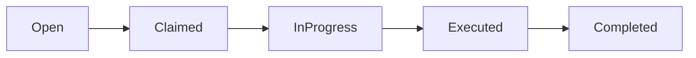

# Bantu.in

> A local peer-to-peer helper marketplace.

Bantu.in makes everyday favors easy to ask for and easy to help with. Neighbors and community members can post tasks — food runs, deliveries, tutoring, moving help, errands — and connect with people nearby who are willing to help.

**Status:** Frontend-only MVP for demo and validation. No backend, no platform fees, no monetization.

**Live demo:** [bantuin-demo.vercel.app](https://bantuin-demo-hrlqpfk2q-gibranfshs-projects.vercel.app/login) — click **Continue with Google** to explore (mock auth, no credentials needed).

---

## What is Bantu.in?

Bantu.in is a **community helper marketplace** — built for any local group that already helps each other informally, but wants a clearer way to post needs, find helpers, and track progress in one place.

Instead of coordinating everything through scattered group chats or social posts, members can:

- Post a structured task with a price range and details
- Browse open requests by category and status
- Offer to help, negotiate terms, and coordinate in one thread
- Follow a task from posted → claimed → in progress → done → paid

Typical use cases include food runs, package delivery, tutoring, moving help, tech support, laundry pickup, and other everyday favors.

The product is offered **free of charge** in this MVP — there are no platform fees and no monetization. Demo seed data uses sample locations and names; the product itself is not tied to a single campus or city.

---

## The problem

Many communities already help each other through WhatsApp groups, social feeds, and word of mouth. It works, but it creates friction:

- Requests get buried under newer posts and chat messages
- It is hard to find relevant helpers or open tasks quickly
- There is no clear status for where a favor stands (posted, claimed, in progress, done)
- Coordination history is scattered across multiple threads
- There is no structured way to build trust or track reputation over time

Bantu.in explores whether a lightweight platform can solve these problems without adding more friction than the current process.

---

## Our approach

Bantu.in starts with a **validation-first** mindset:

- Keep the product free — no platform fees or payment rails in this phase
- Solve problems with the smallest possible step; do not add complexity before it is needed
- Meet people where they already communicate — chat and familiar workflows can stay part of the flow
- Ship a demo-quality frontend first to learn whether structured requests feel better than ad-hoc coordination

This repository contains that frontend MVP: a fully interactive demo with mock data, designed for walkthroughs, stakeholder demos, and user feedback.

---

## How it works

Bantu.in has two roles:

| Role | Who they are | What they do |
|------|--------------|--------------|
| **Helpee** | Person who needs help | Posts a task, agrees on price, verifies work, releases payment |
| **Helper** | Person who offers help | Browses open tasks, offers to help, executes the favor, submits completion notes |

Every task moves through a five-step lifecycle:



1. **Open** — Helpee posts a task with a price range and details
2. **Claimed** — A helper offers to help; both parties negotiate in chat
3. **In progress** — Helpee locks the agreed price; helper executes the task
4. **Executed** — Helper submits completion notes; helpee reviews the work
5. **Completed** — Helpee verifies and releases payment from their wallet balance

---

## Current features (frontend MVP)

All features below are implemented in the frontend with **in-memory mock state**. Nothing persists across page refreshes or logout.

### Authentication and routing

- Mock **Continue with Google** sign-in (simulated 1s delay; no real OAuth)
- **Auth guard** on protected pages; unauthenticated users redirect to `/login`
- `/` redirects to `/feed` when authenticated, or `/login` when not

### Dual-role experience

- **Helpee** role: post tasks, agree on price, verify work, release payment
- **Helper** role: browse open tasks, offer to help, execute work, submit completion notes
- Role toggle in desktop navbar tabs and profile modal, with toast feedback on switch
- Helpee-only posting enforced on `/post` and the mobile bottom-nav Post button

### Feed workspace (`/feed`)

Four workspace tabs accessible via the desktop sidebar and navbar:

| Tab | Features |
|-----|----------|
| **Browse (Home)** | Hero with personalized greeting and open-task count; category chips (All, Food run, Tutoring, Moving); status tabs (Open, Claimed) with dynamic counts; navbar search across title, description, category, and location; `?mine=1` filter for the user's posted tasks; responsive request-card grid; role-specific empty states; loading skeletons |
| **Inbox** | Chat list for non-open tasks; mock fallback conversations when empty; last message preview, partner rating, status badge; links to task detail |
| **Schedule** | Active tasks with partner name, deadline, agreed price, and status; empty state with browse CTA |
| **Directory** | Community helper cards with star rating, tasks completed, on-time percentage, and verified-member badge |

### Post a task (`/post`, helpee only)

- Form fields: title, description (500 character limit), price min/max (IDR), category (Food run, Tutoring, Moving, General), location, urgent flag, optional photo (local preview), deadline presets (ASAP, Today, Tomorrow, Choose Time, Flexible)
- **Interactive Leaflet map** with preset landmark shortcuts and map pinpoint selection (demo seed uses sample landmarks)
- Live **task preview card**; client-side validation; success toast and redirect to the new task detail page
- Helpers who visit `/post` see a switch-to-helpee prompt instead of the form

### Task detail (`/requests/[id]`)

- Full task header: category icon, urgent badge, status badge, location, relative post time, estimated duration, deadline, description, and hero image
- **Offer to Help** button for helpers on open tasks
- **5-step progress timeline:** Task Posted → Helper Assigned → Terms Negotiated → Task Executed → Verified & Paid
- **Status action dashboard** by lifecycle stage:
  - *Claimed:* helpee sets final price via slider, then locks terms
  - *In progress:* helper submits completion notes, then marks task as executed
  - *Executed:* helpee reviews submission notes, then verifies and releases payment
  - *Completed:* success confirmation with wallet payment note
- **Mock chat** with expandable panel, send messages, and simulated auto-replies keyed to task status
- Assigned **helper profile card** with message shortcut
- Feedback alerts (success banner after posting, delay warning during execution)

### Profile and wallet

Opened via the avatar or **Wallet** nav item (profile modal):

- User avatar and verified-member badge
- Role-specific reputation stats (rating, tasks completed, on-time rate)
- **Wallet balance** display with IDR formatting
- Top-up button (demo intentionally fails with an error alert)
- Role switch and logout (resets all mock state to seed data)

### Navigation and shell

- **Desktop:** persistent sidebar (workspace nav + category shortcuts), top navbar with search, decorative notification bell, and Post a task CTA for helpees
- **Mobile:** bottom nav (Browse, Post, Tasks via `/feed?mine=1`), hamburger drawer mirroring sidebar items
- App footer with trust metrics, link columns, and social icon placeholders
- Page transitions, dark/light theme support (`next-themes`), and Sonner toast notifications

### Mock data and limitations

- All state lives in React Context ([`src/context/app-context.tsx`](src/context/app-context.tsx)) — **no API, no database, no persistence**
- Seed tasks in [`src/lib/mock-data.ts`](src/lib/mock-data.ts) use sample names, prices, and locations for demo purposes only
- Wallet balance updates in-memory when payment is released
- Logout resets requests and session state to seed data

---

## What's not built yet

The following are **not functional** in this MVP:

- Real Google OAuth or user accounts
- Backend API or database
- Push notifications (the bell icon is visual only)
- Real wallet top-up or payment processing
- Cross-session or cross-device persistence

For remaining UI polish gaps (dynamic inbox badge wiring, draft/cancelled task statuses, and more), see [`features-implementation.md`](features-implementation.md).

The [`bantuin-backend/`](../bantuin-backend/) directory exists as a placeholder; no backend code has been started.

---

## Tech stack

- **Framework:** Next.js 16 (App Router), React 19, TypeScript 5
- **Styling:** Tailwind CSS v4, shadcn/ui (base-nova), Inter
- **Maps:** Leaflet (location picker on the post form)
- **State:** React Context (`src/context/app-context.tsx`) — in-memory mock data only
- **Package manager:** Yarn

---

## Project structure

```
bantuin-frontend/
├── src/app/           # Routes: login, feed, post, requests/[id]
├── src/components/    # UI shell, forms, cards, chat, map
├── src/context/       # App state and task lifecycle actions
├── src/lib/           # Mock data, categories, formatting, types
└── public/images/     # Task photos and brand assets
```

---

## Getting started

**Prerequisites:** Node.js 20+, Yarn

```bash
cd bantuin-frontend
yarn install
yarn dev
```

Open [http://localhost:3000](http://localhost:3000). Click **Continue with Google** to enter the demo.

| Command | Description |
|---------|-------------|
| `yarn dev` | Start dev server |
| `yarn build` | Production build |
| `yarn start` | Run production server |
| `yarn lint` | ESLint |

---

## Demo walkthrough

Try the full task lifecycle locally or on the [live demo](https://bantuin-demo.vercel.app/login):

1. **Sign in** — Click Continue with Google on `/login` (mock auth, no credentials needed)
2. **Browse tasks** — Explore the feed, filter by category or status, or search from the navbar
3. **Post a task** — Switch to Helpee role, open `/post`, fill in details, and publish
4. **Offer to help** — Switch to Helper role, open an open task, and click Offer to Help
5. **Complete the flow** — Negotiate in chat, lock terms, submit work, verify, and release payment

Use the profile modal to switch roles, check wallet balance, or log out and reset the demo.

---

## Routes reference

| Route | Description |
|-------|-------------|
| `/` | Redirects to `/feed` (authenticated) or `/login` (guest) |
| `/login` | Mock Google sign-in page |
| `/feed` | Main workspace: Browse, Inbox, Schedule, Directory tabs |
| `/feed?mine=1` | Filter feed to the current user's posted tasks (mobile "Tasks" tab) |
| `/post` | Post a new task (helpee only) |
| `/requests/[id]` | Task detail, lifecycle actions, and mock chat |

---

## Related docs

- [`design-system.md`](design-system.md) — UI tokens, typography, and component guidelines
- [`features-implementation.md`](features-implementation.md) — Design system features not yet built in the MVP

---

© 2026 Bantu.in. Built with care for the community.
